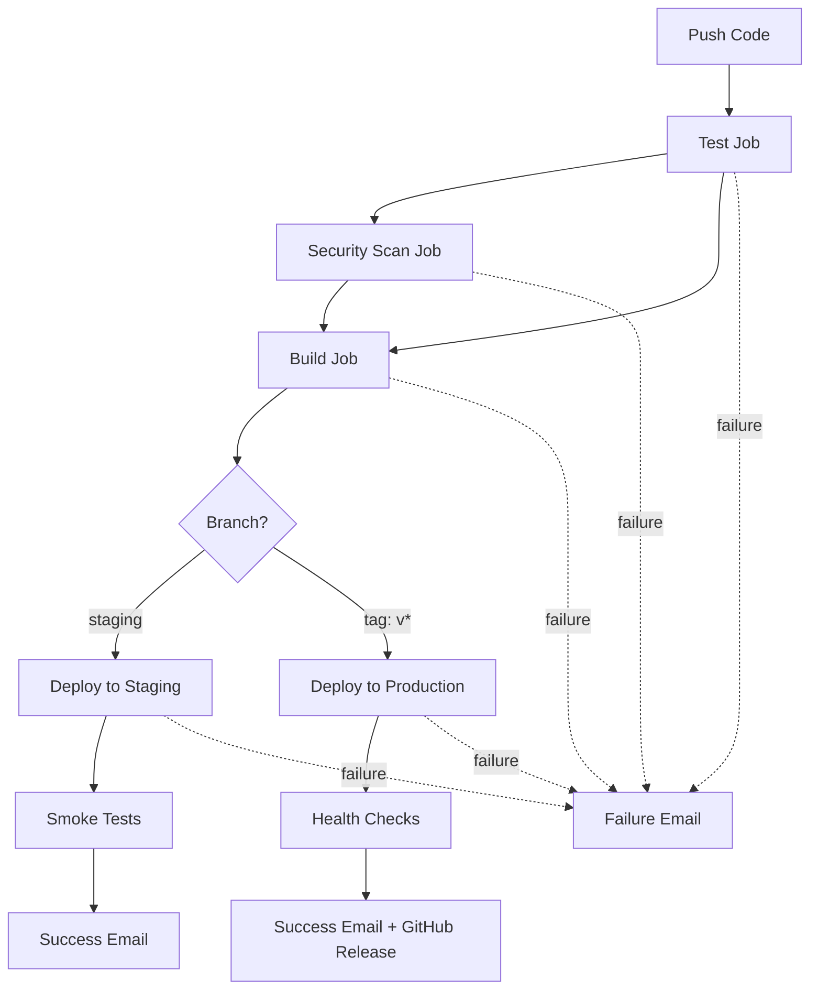

# GitHub Actions CI/CD Pipeline

Complete CI/CD workflow for automated testing, building, and deployment of Flask application using GitHub Actions.

## 🎯 Overview

This GitHub Actions workflow automates the entire software delivery process:

```
Push Code → Test → Security Scan → Build → Deploy to Staging/Production → Notify
```

**Workflow File**: [`.github/workflows/ci-cd.yml`](.github/workflows/ci-cd.yml)

**Workflow URL**: `https://github.com/YOUR_USERNAME/YOUR_REPO/actions`

---

## ✨ Features

### 🔄 Continuous Integration
- ✅ Automated testing with pytest
- ✅ Code coverage reporting (88%+)
- ✅ Code quality checks (flake8)
- ✅ Security vulnerability scanning (Safety, Bandit)
- ✅ Python syntax validation

### 🚀 Continuous Deployment
- ✅ Automated deployment to staging (on `staging` branch)
- ✅ Automated deployment to production (on version tags)
- ✅ SSH-based deployment to EC2 instances
- ✅ Smoke tests and health checks
- ✅ Service restart automation

### 📦 Build & Artifacts
- ✅ Build artifact creation and storage
- ✅ Test results preservation
- ✅ Coverage reports (HTML & XML)
- ✅ Security scan reports
- ✅ 30-day artifact retention

### 📧 Notifications
- ✅ Email notifications on success
- ✅ Email notifications on failure
- ✅ Deployment status updates
- ✅ Detailed error reporting

---

## 🏗️ Workflow Architecture



### Workflow Components

| Component | Purpose | Runs On |
|-----------|---------|---------|
| **Test** | Unit tests, coverage, linting | Every push/PR |
| **Security** | Vulnerability scanning | After tests pass |
| **Build** | Create deployment artifact | After tests & security |
| **Deploy Staging** | Deploy to staging server | Push to `staging` branch |
| **Deploy Production** | Deploy to production server | Push tag `v*` |
| **Notify** | Email notifications | Success/Failure |

---

## 📋 Prerequisites

### Required Accounts
- [x] GitHub account with repository
- [x] AWS account (for EC2 instances)
- [x] Email account (Gmail/SendGrid for notifications)

### Infrastructure Setup
- [x] **Staging EC2 instance** (t2.micro - free tier)
- [x] **Production EC2 instance** (t2.small recommended)
- [x] Both servers configured with Python, Nginx, and systemd service

### Repository Setup
- [x] Flask application in repository
- [x] Tests written (pytest)
- [x] `requirements.txt` with dependencies
- [x] Workflow file in `.github/workflows/ci-cd.yml`

---

## 🚀 Quick Start

### Step 1: Fork/Clone Repository

```bash
git clone https://github.com/YOUR_USERNAME/YOUR_REPO.git
cd YOUR_REPO
```

### Step 2: Setup EC2 Servers

**Quick setup:**
```bash
# On both staging and production servers:
sudo apt update && sudo apt upgrade -y
sudo apt install -y python3 python3-venv nginx
sudo mkdir -p /var/www/flask-app
sudo chown ubuntu:ubuntu /var/www/flask-app
cd /var/www/flask-app
python3 -m venv venv
```


### Step 3: Configure GitHub Secrets

Go to: **Repository → Settings → Secrets and variables → Actions**

Add these **14 secrets**:

📂 Deployment Secrets (8)

**Staging:**
```
STAGING_HOST         → 3.110.45.123 (your EC2 IP)
STAGING_USER         → ubuntu
STAGING_SSH_KEY      → [private SSH key content]
STAGING_DEPLOY_PATH  → /var/www/flask-app
```

**Production:**
```
PRODUCTION_HOST         → 13.234.56.78 (your EC2 IP)
PRODUCTION_USER         → ubuntu
PRODUCTION_SSH_KEY      → [private SSH key content]
PRODUCTION_DEPLOY_PATH  → /var/www/flask-app
```

**For Gmail:**
```
EMAIL_SERVER      → smtp.gmail.com
EMAIL_PORT        → 587
EMAIL_USERNAME    → yourproject.cicd@gmail.com
EMAIL_PASSWORD    → [Gmail App Password - 16 chars]
EMAIL_FROM        → yourproject.cicd@gmail.com
EMAIL_RECIPIENTS  → your.email@gmail.com
```

**Setup Gmail App Password:**
1. [Google Account](https://myaccount.google.com/) → Security
2. Enable 2-Step Verification
3. App passwords → Generate for "Mail"
4. Copy 16-character password


### Step 4: Push Code to Staging

```bash
# Initial setup
git add .
git commit -m "Setup GitHub Actions CI/CD"
git push origin staging
```

### Step 5: View Workflow

1. Go to **Actions** tab in GitHub
2. See workflow running in real-time
3. View logs for each job
4. Check email for notifications

---


### Step 4: Push Code to Production

```bash
# Initial setup
git tag -a v1.1.0 -m "Release v1.1.0"
git push origin v1.1.0
```

### Step 5: View Workflow

1. Go to **Actions** tab in GitHub
2. See workflow running in real-time
3. View logs for each job
4. Check email for notifications
5. Also it will create Release for the same

---


## 🔧 Workflow Jobs

### Job 1: Test Application

**Runs on**: `ubuntu-latest`  
**Triggers**: Every push, pull request  
**Duration**: ~2 minutes

```yaml
Steps:
1. Checkout code
2. Setup Python 3.9
3. Install dependencies
4. Lint with flake8
5. Run pytest tests
6. Generate coverage report
7. Upload test results
8. Upload coverage report
```

**Artifacts Created:**
- `test-results.xml` (JUnit format)
- `coverage-report/` (HTML coverage report)

**Success Criteria:**
- All tests pass (11/11)
- Coverage ≥ 88%
- No critical flake8 errors

### Job 2: Security Scan

**Runs on**: `ubuntu-latest`  
**Triggers**: After tests pass  
**Duration**: ~1 minute

```yaml
Steps:
1. Checkout code
2. Setup Python 3.9
3. Install dependencies
4. Run Safety check (dependency vulnerabilities)
5. Run Bandit scan (code security issues)
6. Upload security report
```

**Artifacts Created:**
- `bandit-report.json` (security scan results)

**Success Criteria:**
- No high-severity vulnerabilities
- No critical security issues

### Job 3: Build Application

**Runs on**: `ubuntu-latest`  
**Triggers**: After test & security pass  
**Duration**: ~1 minute

```yaml
Steps:
1. Checkout code
2. Setup Python 3.9
3. Install dependencies
4. Create build artifact (tar.gz)
5. Upload build artifact
```

**Artifacts Created:**
- `flask-app-<commit-sha>.tar.gz` (deployable package)
- Retained for 30 days

**Build Contents:**
```
build/
├── app.py
└── requirements.txt
```

### Job 4: Deploy to Staging

**Runs on**: `ubuntu-latest`  
**Triggers**: Push to `staging` branch  
**Duration**: ~2-3 minutes

```yaml
Steps:
1. Download build artifact
2. Setup SSH connection
3. Copy files to staging server (SCP)
4. Extract and install dependencies
5. Restart Flask service
6. Run smoke tests
7. Send success email
```

**Deployment Process:**
```bash
# On GitHub Actions runner:
scp flask-app.tar.gz ubuntu@staging-server:/var/www/flask-app/

# On staging server:
cd /var/www/flask-app
tar -xzf flask-app.tar.gz
cd build && ../venv/bin/pip install -r requirements.txt
cp build/* .
sudo systemctl restart flask-app
```

**Smoke Tests:**
- `curl http://staging-server/api/health` (must return 200)
- `curl http://staging-server/api/info` (must return 200)

**Success Criteria:**
- Files transferred successfully
- Dependencies installed
- Service restarted without errors
- Smoke tests pass

### Job 5: Deploy to Production

**Runs on**: `ubuntu-latest`  
**Triggers**: Push tag `v*` (e.g., v1.0.0)  
**Duration**: ~2-3 minutes

```yaml
Steps:
1. Download build artifact
2. Setup SSH connection
3. Copy files to production server (SCP)
4. Extract and install dependencies
5. Restart Flask service
6. Run health checks
7. Create GitHub Release
8. Send success email
```

**Health Checks:**
- `curl http://production-server/api/health`
- `curl http://production-server/api/info`

**GitHub Release:**
- Automatically created with tag
- Includes build artifact
- Release notes generated

**Success Criteria:**
- Zero-downtime deployment
- Health checks pass
- Service running properly

### Job 6: Notify on Failure

**Runs on**: `ubuntu-latest`  
**Triggers**: Any job failure  
**Duration**: ~30 seconds

```yaml
Steps:
1. Send failure email notification
```

**Email Includes:**
- Repository and branch
- Commit SHA and author
- Job that failed
- Link to workflow run logs

---
